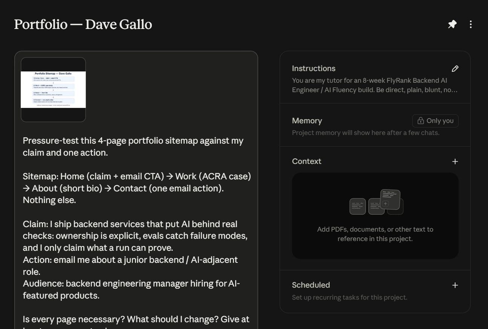

# Portfolio Sitemap & Toolkit

**Dave Andrei Almia Gallo · Backend AI Engineer @ FlyRank · Week 1**

Brief: [sitemap-toolkit-brief.md](./sitemap-toolkit-brief.md)

## Proof inputs (locked)

**Claim:** I ship backend services that put AI behind real checks: ownership is explicit, evals catch failure modes, and I only claim what a run can prove.

**Person:** A backend engineering manager hiring for AI-featured products.

**Action:** Email me about a junior backend / AI-adjacent role — `gallodave.cs@gmail.com`

**Voice card:** direct, plain, blunt, no buzzwords, show the work

---

## Sitemap sketch (text version)

Four pages. Nothing else.

```
[ Home / Hero ]
      |
      | claim + who it's for + primary CTA (email)
      v
[ Work ]
      |
      | ACRA case (problem → decisions → outcome)
      | (more cases only when they earn a slot)
      v
[ About ]
      |
      | short bio, OLFU, FlyRank, how I work with AI
      v
[ Contact ]
      |
      | email CTA only — same one action
```

| Page | Earns its place because… |
|---|---|
| **Home** | States the claim in one breath and points at the email action. |
| **Work** | Only proof that the claim is real (starts with ACRA). |
| **About** | Makes you a specific person, not a template. |
| **Contact** | One action: email about a junior backend / AI-adjacent role. |

**Explicitly not on the map:** blog, services menu, fake “testimonials,” extra project pages with no case, separate “AI tools” page.

### Sitemap diagram


*Optional: add a hand-drawn paper photo under `work/week-1/assets/` if the grader wants one.*

---

## Free toolkit checklist

| Tool | Status |
|---|---|
| Claude | active (per FL-01) |
| ChatGPT | active (per FL-01) |
| Gemini | *confirm / create* |
| Perplexity | *confirm / create* |

---

## Claude Project setup

**Suggested name:** `FlyRank Portfolio — Dave Gallo` (8 weeks)

**Standing instructions to paste:**

> You are my tutor for an 8-week FlyRank Backend AI Engineer / AI Fluency build. Be direct, plain, blunt, no buzzwords. Show the work. Push back when I skip verification or overclaim.
>
> **Proof statement:** I ship backend services that put AI behind real checks: ownership is explicit, evals catch failure modes, and I only claim what a run can prove. This is for a backend engineering manager hiring for AI-featured products — if that standard shows up in the work, email me about a junior backend / AI-adjacent role.
>
> **Voice:** direct, plain, blunt, no buzzwords, show the work.
>
> Never invent numbers. If I haven't given data, say so and tell me what to run.

### Claude Project screenshot



Project name: **Portfolio — Dave Gallo**. Instructions sidebar shows tutor + proof statement. Pressure-test prompt + sitemap diagram attached in-chat.

---

## Pressure-test (claim + action vs sitemap)

**Prompt used:**

> Pressure-test this 4-page portfolio sitemap (Home, Work, About, Contact) against my claim and one action.
> Claim: I ship backend services that put AI behind real checks…
> Action: email me about a junior backend / AI-adjacent role.
> Work page currently features ACRA (color-accessibility re-encoding; I owned pipeline re-encoding + frontend). Is every page necessary? What should I change?

**Tutor pressure-test output:**

The map is the right *size*. Four pages is enough to go claim → proof → person → email. Cuts are good: no blog, no filler.

**What earns its place**
- Home: yes, if the hero is the claim + the email CTA — not a soft “welcome to my portfolio.”
- Work: yes, but only if ACRA is framed as backend/AI judgment (evals, exclude-person decision, locked pass bars), not as a pretty demo. A hiring manager for backend/AI roles will bounce if Work reads like a UI gallery.
- About: yes, short. Tie FlyRank + OLFU to how you decide what AI owns vs what you own.
- Contact: yes — one mailto / form aimed at that exact action.

**What to change (at least one)**
1. On Home, lead with the claim in your voice, then a single button: “Email me about a junior backend / AI role.” Don’t bury the action under icons.
2. On Work, title the ACRA case so the backend/AI check is obvious in the first line (e.g. “ACRA — re-encoding with explicit ownership + locked metrics”), not just “color accessibility app.”
3. Don’t add a fifth page until a second case can survive the same three-beat test as ACRA.

**One change I’ll make:** Work case titles lead with the backend/AI proof, not the product category.

### Pressure-test screenshot

*Pending — screenshot of Claude Project prompt + this output (or paste Claude’s own reply here after you run it).*

---

## Pass checklist

- [x] Small sitemap; every page argued against claim + action
- [ ] Claude / ChatGPT / Gemini / Perplexity accounts confirmed
- [x] Claude Project created with proof statement + tutor instructions (screenshot)
- [x] Pressure-test run; at least one change noted
- [ ] Photo of hand-drawn sitemap sketch
