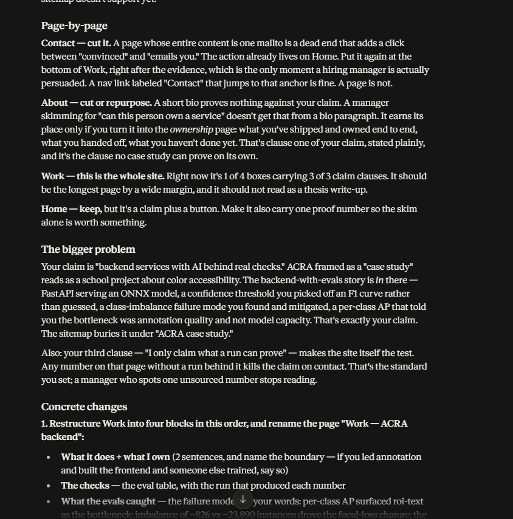

# Week 1 Submission — Portfolio Sitemap & Toolkit

**Dave Andrei Almia Gallo · Backend AI Engineer @ FlyRank · Week 1**

**Submit this folder/link:** https://github.com/Davionnic/flyrank-backend-ai-engineer/tree/main/work/week-1/sitemap-toolkit

Or this README: https://github.com/Davionnic/flyrank-backend-ai-engineer/blob/main/work/week-1/sitemap-toolkit/README.md

Brief (parent): [../sitemap-toolkit-brief.md](../sitemap-toolkit-brief.md)

---

## Proof inputs (locked)

| Piece | Value |
|---|---|
| **Claim** | I ship backend services that put AI behind real checks: ownership is explicit, evals catch failure modes, and I only claim what a run can prove. |
| **Person** | A backend engineering manager hiring for AI-featured products |
| **Action** | Email me about a junior backend / AI-adjacent role — `gallodave.cs@gmail.com` |
| **Voice** | direct, plain, blunt, no buzzwords, show the work |

---

## 1. Sitemap sketch

**Pages (before pressure-test):** Home → Work → About → Contact

| Page | Why it earns a place |
|---|---|
| **Home** | States the claim + primary email CTA |
| **Work** | Proof (ACRA) |
| **About** | Specific person, not a template |
| **Contact** | One action (email) |

**Explicitly not on the map:** blog, services menu, filler project pages.

---

## 2. Free toolkit

| Tool | Status |
|---|---|
| Claude | Active — Project configured (screenshots below) |
| ChatGPT | Active (per FL-01) |
| Gemini | Confirm before final grade if required |
| Perplexity | Confirm before final grade if required |

---

## 3. Claude Project

**Name:** Portfolio — Dave Gallo

**Custom instructions (pasted):**

> You are my tutor for an 8-week FlyRank Backend AI Engineer / AI Fluency build. Be direct, plain, blunt, no buzzwords. Show the work. Push back when I skip verification or overclaim.
>
> Proof statement: I ship backend services that put AI behind real checks: ownership is explicit, evals catch failure modes, and I only claim what a run can prove. This is for a backend engineering manager hiring for AI-featured products — if that standard shows up in the work, email me about a junior backend / AI-adjacent role.
>
> Voice: direct, plain, blunt, no buzzwords, show the work.
>
> Never invent numbers. If I haven't given data, say so and tell me what to run.

### Screenshot — Project + instructions + pressure-test prompt

---

## 4. Pressure-test prompt + output

**Prompt:**

> Pressure-test this 4-page portfolio sitemap against my claim and one action.
> Sitemap: Home (claim + email CTA) → Work (ACRA case) → About (short bio) → Contact (one email action). Nothing else.
> Claim / action / audience as locked above.
> Is every page necessary? What should I change? Give at least one concrete change.

### Screenshot — Claude output

### One change I’ll make

Rename **Work → Work — ACRA backend** and lead with ownership + evals (what I own, the checks, what evals caught) — not a thesis-style color write-up. Fold Contact into Home/Work CTAs if a standalone Contact page doesn’t earn its own URL.

---

## Pass checklist

- [x] Small sitemap; every page argued against claim + action
- [x] Claude Project with proof statement + tutor instructions (screenshot)
- [x] Pressure-test run; at least one change noted (screenshot)
- [x] Sitemap diagram included
- [ ] Gemini + Perplexity accounts confirmed (if grader requires all four)
