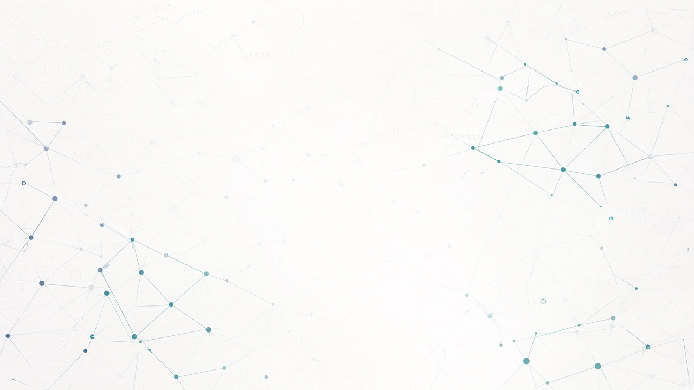
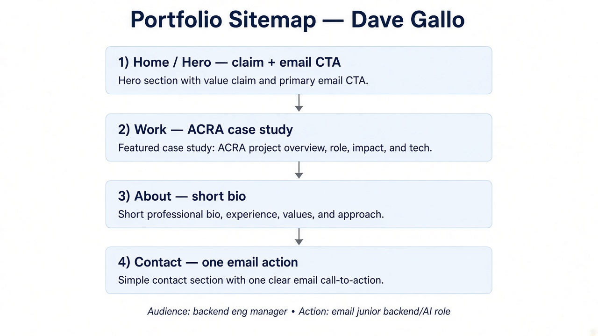
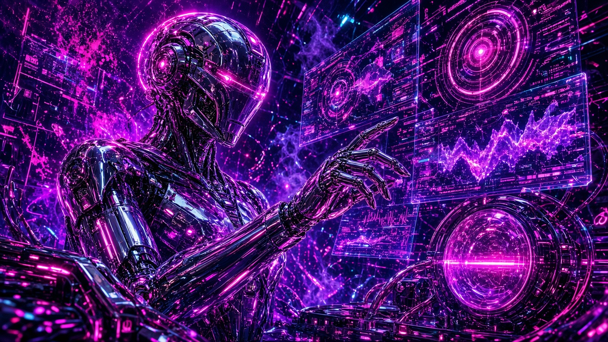

# Kill Your Darlings — Curated Image Set

**Dave Andrei Almia Gallo · Backend AI Engineer @ FlyRank · Week 3**

**Submit:** https://github.com/Davionnic/flyrank-backend-ai-engineer/blob/main/work/week-3/curated-images.md

---

## Images the portfolio actually needs

| Need | Source choice | Asset |
|---|---|---|
| Home hero connective texture | Generated (consistent kit mood) | [hero-connective.png](./assets/hero-connective.png) |
| Logo / favicon | Generated monogram (simple) | [dg-logo.png](./assets/dg-logo.png) |
| Sitemap / structure diagram | Real process capture | [sitemap-diagram.png](./assets/sitemap-diagram.png) |
| Claude Project / pressure-test proof | Real screenshot | [claude-project-pressure-test.png](./assets/claude-project-pressure-test.png) |
| Claude judgment output | Real screenshot | [claude-pressure-test-output.png](./assets/claude-pressure-test-output.png) |
| ACRA product UI / results | **Real capture** (not AI stand-in) | See gather list / capture |
| Task API `/docs` Swagger | **Real capture** | Need from local run |
| About — me | **Real photo only** | Still need to gather (no AI face) |

---

## Keepers (final set in this folder)

### Connective (AI, one style)

Muted navy/teal node grid on near-white — matches identity kit; stays behind the claim text.

### Logo

### Real process captures

---

## Rejected generated image (judgment)

**Rejected because:** loud neon cyberpunk robot + holograms. It screams “AI art,” competes with screenshots, and breaks the calm navy/teal kit. Cool ≠ serves the proof. A real ACRA or Swagger capture beats this every time.

---

## Real vs AI calls

| Subject | Call | Why |
|---|---|---|
| ACRA / Task API work | Real screenshots only | Work must be evidence, not illustration |
| Hero texture / logo | AI OK if quiet + on-kit | Connective tissue, not proof |
| My face / About photo | Real photo only | Never generate a person for “me” |
| Neon cyberpunk concept | Rejected | Upstages work; wrong mood |
