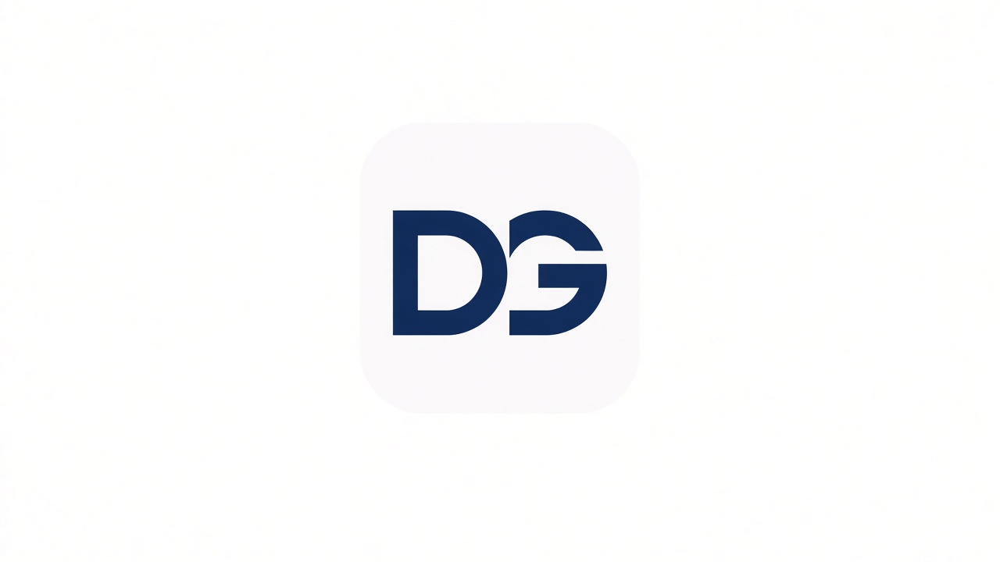

# Identity Kit

**Dave Andrei Almia Gallo · Backend AI Engineer @ FlyRank · Week 3**

**Submit:** https://github.com/Davionnic/flyrank-backend-ai-engineer/blob/main/work/week-3/identity-kit.md

---

## Fonts (free)

| Role | Font | Why |
|---|---|---|
| Heading | **IBM Plex Sans** | Technical, calm, readable at large sizes |
| Body | **IBM Plex Sans** (same family) | One family keeps the site quiet so work stays loud |

Source: Google Fonts (free).

---

## Palette

| Role | Hex | Use |
|---|---|---|
| Near-black text | `#111827` | Body + headings |
| Near-white background | `#FAFAF9` | Page background |
| Main | `#1E3A5F` | Links, logo, primary buttons |
| Accent (at most one) | `#0D9488` | Sparse highlights only |

No neon. No third accent.

---

## Logo / favicon

Simple **DG** monogram in main navy on near-white. No gradients, no mascot — frames the work, doesn’t upstage it.

---

## Two-line style note

**Fonts:** IBM Plex Sans (heading + body). **Colors:** text `#111827`, bg `#FAFAF9`, main `#1E3A5F`, accent `#0D9488`.  
**Mood:** calm, technical, blunt — the portfolio should feel like a clean PR description, not a marketing splash.

*(Add this note to Claude Project **Portfolio — Dave Gallo** as a standing style instruction.)*
