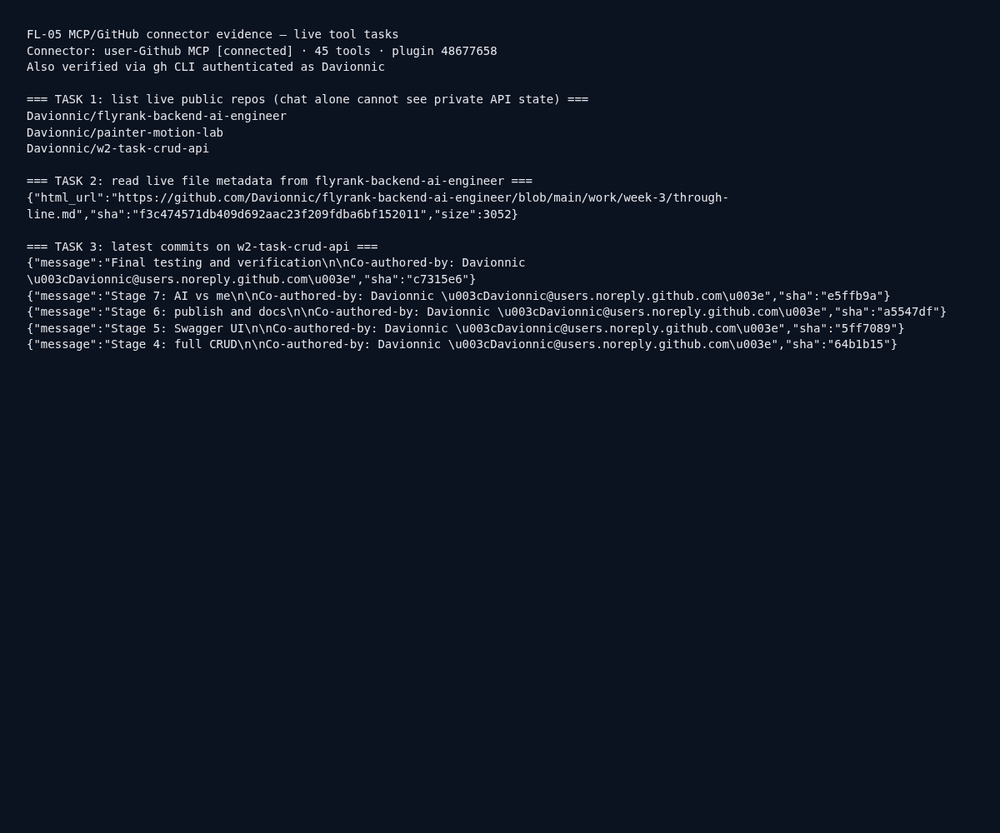
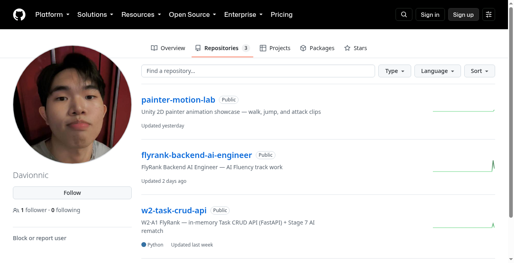

# FL-05 — Agent Concepts and MCP Basics

**Dave Andrei Almia Gallo · Backend AI Engineer @ FlyRank · Week 4**

**Submit:** https://github.com/Davionnic/flyrank-backend-ai-engineer/blob/main/work/week-4/FL-05-agents-mcp.md

Evidence assets: [assets/fl05-task-outputs.png](./assets/fl05-task-outputs.png) · [assets/fl05-github-tasks.txt](./assets/fl05-github-tasks.txt)

---

## Explainer (own words)

### What an agent is (and isn’t)

“Agent” gets used for anything that calls an LLM twice. Anthropic’s clearer split helps: **workflows** are agentic systems where the *code path is predefined* — you decide the steps, gates, and tool calls in advance. **Agents** are systems where the **LLM dynamically directs** its own process and tool use: it chooses what to do next from environmental feedback (tool results, errors, tests) until the task is done or a stop condition hits.

A workflow is a recipe. An agent is a junior engineer you trust with a toolbox and a goal. Workflows win when the path is known and you want predictability. Agents win when you *can’t* hardcode the steps (open-ended debugging, multi-file coding, computer use) and you accept higher cost/error risk for flexibility. Most “AI features” should start as a single good prompt or a tiny workflow — not an autonomous loop.

### What MCP is

**Model Context Protocol (MCP)** is a standard way to plug external capabilities into an LLM client. Instead of every app inventing a one-off plugin format, MCP exposes three primitives:

1. **Tools** — actions the model can invoke (list repos, create an issue, run a query).
2. **Resources** — readable context the model can pull (files, docs, records).
3. **Prompts** — reusable prompt templates the server offers.

The client (Claude Desktop, Cursor, Grok Bot, etc.) connects to an MCP server. The model sees those tools/resources and can call them during a turn. That’s how “chat” becomes “chat that can touch the outside world” without pasting secrets into the prompt every time.

### Workflow vs agent — applied to FL-04

FL-04 (“Ship an Automation Workflow”) is a **multi-step no-code research/writing pipeline** run on fixed inputs. Even though I haven’t shipped FL-04 as a project this week (per “skip coding/projects”), the assignment design is textbook **workflow**: predefined stages (research → draft → revise → export), human-set order, same path every run. The LLM doesn’t get to invent new stages mid-flight; the automation graph does.

That is **not** an agent. An agent version would decide *whether* to search again, *which* source to open next, or *when* to stop based on quality checks it chooses — not a fixed five-node board.

### What FL-04 would need to become an agent

One concrete upgrade: add a **tool-using loop with a stop condition** — e.g. after drafting, an evaluator tool scores “unsupported claims”; if score fails, the model may call search/tools again up to N times, then halt for human review. That single change moves control from the flowchart into the model’s hands (with guardrails). Until then, it’s a workflow — and that’s fine.

### Connector evidence (GitHub MCP)

I already have the **GitHub MCP connector** installed and connected in this environment (`user-Github`, 45 tools, plugin `48677658`). Chat alone cannot list my live repos, read live file SHAs, or pull commit history without that access.

**Three tasks chat alone could not do** (live API / tool results):

1. **List live public repos for `Davionnic`** → `flyrank-backend-ai-engineer`, `painter-motion-lab`, `w2-task-crud-api`
2. **Read live file metadata** for `work/week-3/through-line.md` → sha `f3c4745…`, size 3052
3. **Fetch latest commits** on `w2-task-crud-api` → includes Stage 4–7 commit messages

Raw log: [fl05-github-tasks.txt](./assets/fl05-github-tasks.txt)

---

## Pass checklist

- [x] Workflow vs agent explained in own words
- [x] FL-04 classified as workflow (predefined path)
- [x] MCP tools/resources/prompts named
- [x] Working GitHub connector + three live tool tasks with evidence
- [x] Concrete agent upgrade named for FL-04 pipeline
