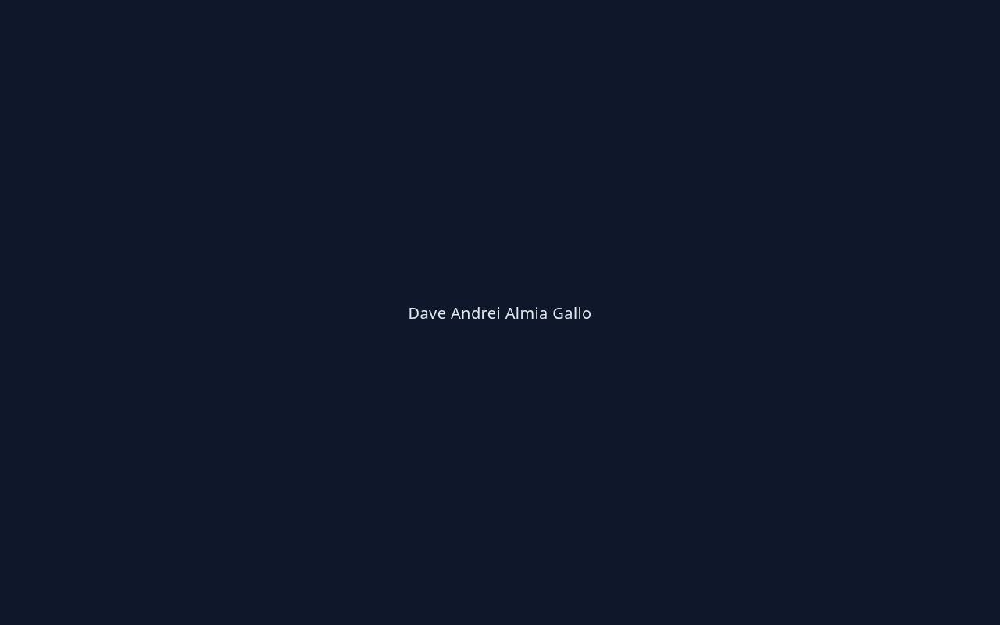

# Empty but Live — Ship a Blank Page

**Dave Andrei Almia Gallo · AI Fluency Week 4**

## Live URL
https://davionnic.github.io/empty-but-live/

## Repo
https://github.com/Davionnic/empty-but-live

## Rationale
See https://github.com/Davionnic/empty-but-live/blob/main/RATIONALE.md

Chosen: **GitHub Pages** (free static). Alternatives: Netlify Drop, Vercel. Backend: not yet.

## Screenshot

## Second device
Open the live URL on a phone / private window — name only on dark background.
